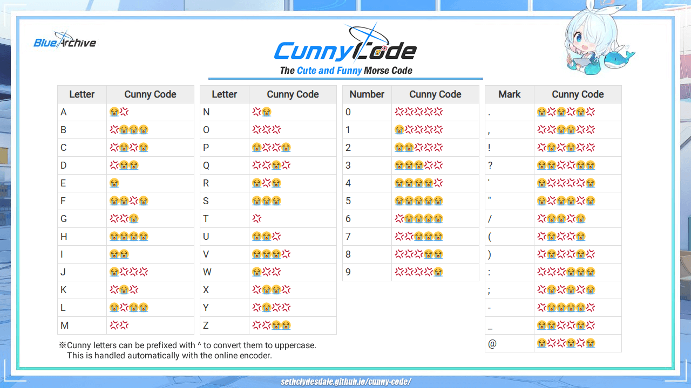
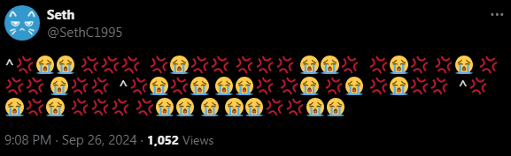
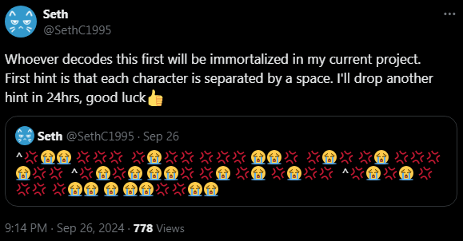
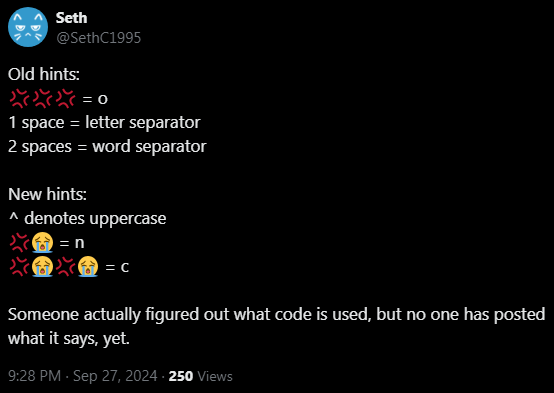
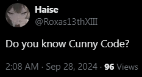

<p align="center"></p>

Cunny Code is a silly Morse Code tool that allows the Senseis of Kivotos to secretly exchange cute and funny messages under the guise of 😭 and 💢. It can be used online or offline via the following links:

**Online Version:** https://sethclydesdale.github.io/cunny-code/

**Offline Version:** [download](https://github.com/SethClydesdale/cunny-code/archive/refs/heads/main.zip)

Give it a try by decoding the message below!

```
💢😭💢💢 💢💢💢 😭😭💢 💢 😭😭💢 💢😭😭😭 😭 😭💢😭💢😭💢 💢😭💢😭 💢💢💢 💢💢 💢😭😭💢😭 😭💢💢 😭💢 💢 💢😭💢😭 😭😭😭😭 😭😭💢💢😭😭 😭😭😭💢 💢😭😭😭💢 ^💢💢😭 😭😭💢😭 ^💢😭💢 💢😭💢 ^😭😭😭 💢💢 ^💢💢😭💢 😭💢😭 ^😭😭😭💢 ^😭💢💢💢 😭💢💢
```

-----

**Quick Links**
- [What is Cunny Code?](#what-is-cunny-code)
- [Using the Offline Version](#using-the-offline-version)
- [Suggestions, Feedback, Bug Reports](#suggestions-feedback-bug-reports)
- [The Great Decoding Experiment](#the-great-decoding-experiment)
- [Special Thanks](#special-thanks)
- [Donate](#donate)


### What is Cunny Code?


Cunny Code is a variation of Morse Code that utilizes the 😭 and 💢 emojis for the standard dot and dash respectively. It has some differences, however, such as custom characters, uppercase AND lowercase support, and 2 spaces to separate words instead of 3. As for "Cunny," it is a meme used amongst a sub-culture of anime fans in reference to **C**ute and f**UNNY** characters, usually loli, as they are naturally cute and often have funny dialogue. Essentially, this is a meme tool designed for fun.

The basic function of this tool is to encode or decode messages, which you can do on the web version [here](https://sethclydesdale.github.io/cunny-code/). You can also use the built in functions `Arona.encode()` or `Arona.decode()` via the console as illustrated below.

**Arona.encode(string)**
```javascript
Arona.encode("Cunny"); // ^💢😭💢😭 😭😭💢 💢😭 💢😭 💢😭💢💢
```

**Arona.decode(string)**
```javascript
Arona.decode("^💢😭💢😭 😭😭💢 💢😭 💢😭 💢😭💢💢"); // Cunny
```

A-Z, numbers, and almost all punctuation characters are supported. 

<p align="center"></p>

Unlike standard Morse Code, Cunny Code is lowercase by default and uses ^ to denote uppercase letters. This in turn makes it more flexible for sharing case-sensitive content, such as links. Please see [this page](https://sethclydesdale.github.io/cunny-code/code/) for more information and for an extended list of supported characters.

Aside from encoding and decoding, this tool also comes packed with some other functions and easter eggs in the form of Arona. You can check out all of Arona's functions [here](https://sethclydesdale.github.io/cunny-code/arona/).


#### Why Did You Choose the 😭 and 💢 Emojis for This Tool?


These emojis were chosen due to their relation to the "cunny" meme. I'll give a brief explanation below.

😭 is often used when something is so cute that it brings one to tears. Usually causing one to unintentionally go "UOH," similar in pronunciation to "WHOA," but with the U more pronounced as "OO." It is derived from the Japanese うおあ which is an expression of suprise/excitement/wonder, similar to the American "whoa."

💢 is often used when a character is being so bratty or mean that it brings one to want to discipline or "correct" said character.

Needless to say, these two emojis are synonymous with the Blue Archive community due to the amount of cute and bratty characters that are present in the game. This is also the reason why the tool is themed after Blue Archive.


### Using the Offline Version
If you're using the offline version you'll have to unzip the files. Once you've done that, you can access this tool offline by opening any of the **index.html** files in the browser of your choice. It should have the same experience as the online version, however, whenever new changes are made they will not be available; you'll have to download the latest version of the repository to get them.


### Suggestions, Feedback, Bug Reports
If you have any suggestions, feedback, questions, or bugs to report, feel free to [open a new issue](https://github.com/SethClydesdale/cunny-code/issues) in this repository so we can correct those bratty bugs💢💢💢 You can also find additional reporting methods [here](https://sethclydesdale.github.io/cunny-code/report/) if you do not have a GitHub account.


### The Great Decoding Experiment

Before this tool was released I held a fun little experiment or "contest" to see who could decode Cunny Code without the decoder. I posted the following [on Twitter](https://x.com/SethC1995/status/1839472034721456176) (X) on September 26th, 2024:

<p align="center"></p>

I then announced the contest and gave some hints on decoding the message. The first person who could decode this message would have their name mentioned by Arona when you encode or decode "Who was the first person to decode Cunny Code?"

<p align="center"></p>

Of course, the first hint I gave above wasn't very helpful, so I also gave one character away, which was "o" and mentioned that words are separated by 2 spaces. While some were able to fill in a few blanks and figure out what code was used, 24hrs passed without an answer and I posted the next set of hints:

<p align="center"></p>

At long last, [Haise-sensei](https://x.com/Roxas13thXIII/status/1839909996383088696) cracked the Cunny Code and had his name immortalized in this project's code.

<p align="center"></p>

While this was mostly for fun, it was also a great test to see if anyone could decode "Cunny Code" without knowing what it is. It will obviously become easier now that this tool is released, but it's proof that Cunny Code is an excellent method for concealing messages, yet still communicating publicly with only those who know the code.


### Special Thanks
Cunny Code was made possible thanks to...
- [morsecode.world](https://morsecode.world/international/morse2.html) for their comprehensive Morse Code resources.
- [nulla2011](https://github.com/nulla2011) for the [Blue Archive Logo Generator](https://github.com/nulla2011/bluearchive-logo).
- [Blue Archive Wiki](https://bluearchive.fandom.com/wiki/Arona/Gallery) and Blue Archive itself for the imagery and audio used in this project.
- [BlueSechi](https://www.youtube.com/watch?v=T9F1Wk8DQdg) for the dancing Alice.
- Google for [Noto Sans](https://fonts.google.com/noto/specimen/Noto+Sans) and [DAJI](https://x.com/daji_nhnyk/status/1840259471819280870) for letting me know the font that Blue Archive uses.
- [FontAwesome](https://github.com/FortAwesome/Font-Awesome) for the awesome icons.
- [13rac1](https://github.com/13rac1) for the [Twemoji](https://github.com/13rac1/twemoji-color-font?tab=readme-ov-file) font so we could achieve that iconic U😭H.
  - The version of the font used in this repo is a COLR/CPAL version from [ctan.org](https://ctan.org/pkg/twemoji-colr) which has support for both Chrome and Firefox.
- My cunny brothers who helped me test this tool before release.
- The many Senseis who helped support or contribute to this project, whether it was on GitHub or outside of it.


### Donate
If you found this project cute or funny, please see the [Donate page](https://sethclydesdale.github.io/cunny-code/donate/) for ways to support my work.

-----

<div align="center">[](https://sethclydesdale.github.io/cunny-code/404)</div>
<div align="center">Built with Cunny and Love</div>
